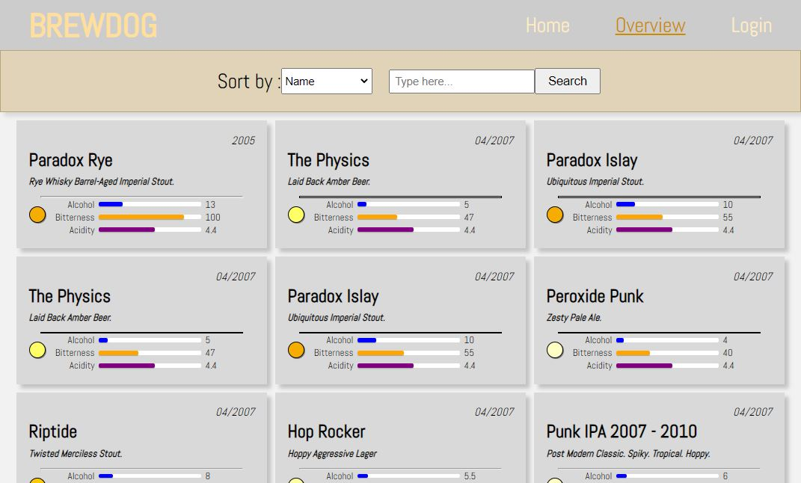

# README van deze Brewdog website

## inleiding

Heb je wel eens een Brewdog bier gedronken? Wellicht vond hem heerlijk, maar welke was het ook alweer en welke andere brewdogs bieren zijn na dit verrukkelijke biertje ook de moeite waard om eens te gaan proberen? Ik wens je alvast veel succes en geduld om alle 100en brewdogs bieren te vergelijken en welk brewdog bier de volgende aanwinst voor jou gaat worden want dit zijn er nog wel wat.

Deze applicatie gaat hier een oplossing voor bieden om grip op de zaak te krijgen. Op de website zelf kan je een lijst zien van alle beschikbare brewdog bieren met bijbehorende eigenschappen zoals bitterheid en alcohol percentage.

Je kan aan de hand van filters gemakkelijk de biertjes sorteren op een specifieke eigenschap zodat je een idee krijgt waarin de biertjes zich verschillen. Als je vervolgens echt meer te weten wil komen over het biertje kan je naar de pagina gaan waar alle details van het biertje op een rij staat. Een beschrijving en ook bij welke gerechten dit biertje het beste tot zijn recht komt.

Als je geen zin hebt om altijd bij hetzelfde biertje te blijven je ook jezelf verder verdiepen in vergelijkbare biertjes die tevens ook op de website worden opgesomd.

Op deze manier heeft de gebruiker een makkelijke manier om zicht te krijgen op alle beschikbare bieren van de Brewdog brouwerij.

#Dependencies
    "axios": "^0.26.1"
    "jwt-decode": "^3.1.2"
    "random-seedable": "^1.0.8"
    "react": "^17.0.2"
    "react-dom": "^17.0.2"
    "react-hook-form": "^7.30.0"
    "react-router-dom": "^5.2.0"
    "react-scripts": "5.0.0"
    "web-vitals": "^2.1.4"

#API's

Dit project maakt gebruik van de punk API om gegevens van de brewdog beers binnen te halen:
https://punkapi.com/documentation/v2

Voor inloggen en regristreren van nieuwe accounts maakt het gebruik van de Novi back-end.

# Installation steps

installeer alle dependencies voor het runnen van deze app. Doe dit met het commando 

### `npm install`

Na dat alles is geinstalleerd run de app via

### `npm start`

# Credits

Dit project is het eind opdracht van de front-end leerlijn van Novi.

_Mick Munsterman_

_1-5-2022_
